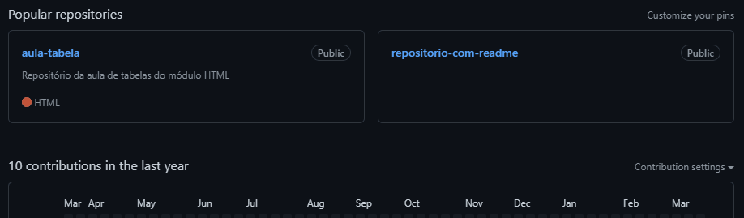

# Projeto com README
Um projeto de teste com um arquivo README🔥🚀



## Tecnologias Utilizadas
- HTML
- CSS
- JS

## Como Utilizar
---
1 - Clone o projeto
``` 
git clone urldoprojeto
```
---
2 - Acesse a pasta do projeto
```
cd github/repositorio-com-readme
```
